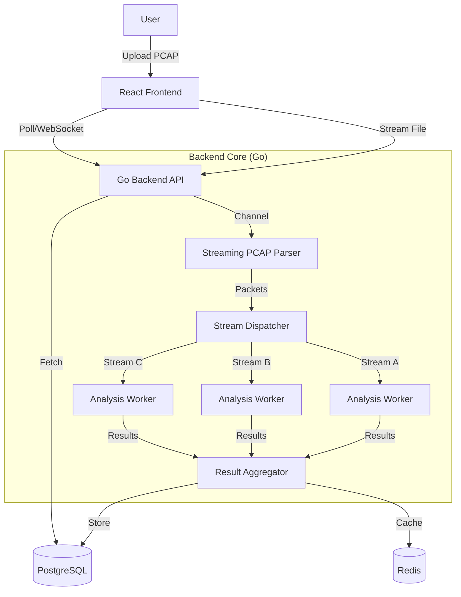

# Network/PCAP Analyzer Tool - Execution Plan

## Executive Summary
Build an automated, enterprise-grade PCAP analysis tool to replace manual Wireshark workflows. The system will ingest PCAP files, reconstruct TCP streams, and automatically detect complex network symptoms (Dillon's symptoms, 3001 events, timeouts) using a high-performance Go backend.

## 🏗️ System Architecture

**Decision**: **Go Backend with PostgreSQL**
**Rationale**: Selected for raw performance, concurrency support, and ability to handle large (>1GB) PCAP files via streaming.



### Core Technology Stack
*   **Frontend**: React 18, TypeScript, Tailwind CSS, Vite.
*   **Backend**: Go (Golang) 1.21+.
*   **Web Framework**: Gin (`github.com/gin-gonic/gin`).
*   **Packet Processing**: `gopacket` (`github.com/google/gopacket`).
*   **Database**: PostgreSQL 15+ (for structured analysis results).
*   **Caching/PubSub**: Redis (for job tracking and real-time updates).
*   **Infrastructure**: Docker & Docker Compose.

---

## ⚡ Performance & Scalability Strategy

### 1. Streaming Analysis (The "No-RAM-Limit" Approach)
Instead of loading a 500MB PCAP into memory, we will stream it:
*   **Reader**: The `pcap.OpenOffline` handle reads the file block-by-block.
*   **Pipeline**: Packets are pushed to a buffered channel (`chan gopacket.Packet`).
### Phase 1: The "Engine" (Backend Foundation)
**Goal**: Parse a PCAP and output JSON analysis to console.
1.  **Init**: Setup Go module, Docker Compose (Postgres + Redis).
2.  **Parser**: Implement `gopacket` streaming reader.
3.  **Stream Reassembly**: Build the 5-tuple hash map to track TCP states.
4.  **Analyzer Modules**:
    *   *Retransmission Detector*: Track duplicate sequence numbers.
    *   *Timing Analyzer*: Calculate deltas (SYN->SYN-ACK, Request->Response).
    *   *Pattern Matcher*: Implement "Dillon's Symptoms" logic.

### Phase 2: The API & Storage
**Goal**: Upload a file via curl and get an ID back.
1.  **API**: Create `POST /upload` (streaming upload) and `GET /analysis/:id`.
2.  **Persistence**: Design PostgreSQL schema for `Analyses`, `Streams`, and `Issues`.
3.  **Job Queue**: Use Redis to track "Processing", "Completed", "Failed" states.

### Phase 3: The Frontend Dashboard
**Goal**: Visual interaction.
1.  **Upload UI**: Drag-and-drop zone with progress bar.
2.  **Dashboard**: Summary cards (Total Streams, Issues Found).
3.  **Stream List**: Virtualized list (react-window) to handle 10k+ rows efficiently.
4.  **Detail View**: The "Ladder Diagram" (Sequence Diagram) using SVG/Canvas.

### Phase 4: Advanced Visuals & Polish
1.  **Network Topology**: Use **React Flow** to visualize connections between IPs.
2.  **Packet Drill-down**: Use **react-hex-editor** to display raw packet payloads in a hex/ASCII format.
3.  **Timeline View**: Implement a "Ladder Diagram" using **Recharts** or custom SVG.
4.  **Advanced Protocol Detection**: Integrate **go-dpi** for deep packet inspection on the backend.
5.  **Reporting**: Export to PDF/JSON.

---

## 🛠️ Detailed Data Structures (Go)

```go
// internal/domain/stream.go

type Stream struct {
    ID          string        `json:"id"`           // Hash of 5-tuple
    ClientIP    net.IP        `json:"client_ip"`
    ServerIP    net.IP        `json:"server_ip"`
    ServerPort  uint16        `json:"server_port"`
    Protocol    string        `json:"protocol"`     // "TCP", "TLSv1.2"
    SNI         string        `json:"sni,omitempty"` // Extracted from ClientHello
    
    Stats       StreamStats   `json:"stats"`
    Issues      []Issue       `json:"issues"`
    Packets     []PacketMeta  `json:"packets,omitempty"` // Only stored if requested
}

type StreamStats struct {
    StartTime       time.Time     `json:"start_time"`
    Duration        time.Duration `json:"duration"`
    PacketCount     int           `json:"packet_count"`
    Retransmits     int           `json:"retransmits"`
    RSTCount        int           `json:"rst_count"`
    ZeroWindowCount int           `json:"zero_window_count"`
    MaxGap          time.Duration `json:"max_gap"`
    MinMSS          uint16        `json:"min_mss"`
}

type Issue struct {
    Type        string        `json:"type"`        // "Critical", "Warning"
    Code        string        `json:"code"`        // "HIGH_RETRANS", "TIMEOUT_RST"
    Description string        `json:"description"`
    Timestamp   time.Time     `json:"timestamp"`
}
```

## ✅ Immediate Next Steps
1.  **Initialize Repository**: Create the folder structure.
2.  **Docker Setup**: Create `docker-compose.yml` with Postgres and Redis.
3.  **Go Mod Init**: `go mod init github.com/citrix/pcap-analyzer`.
4.  **Proof of Concept**: Write a simple `main.go` that uses `gopacket` to count packets in a sample file.
